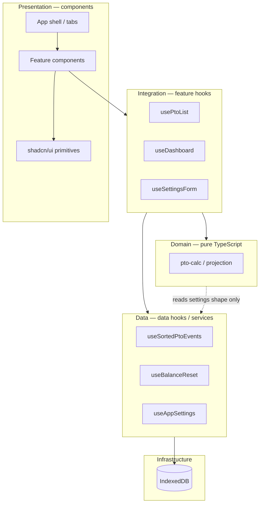
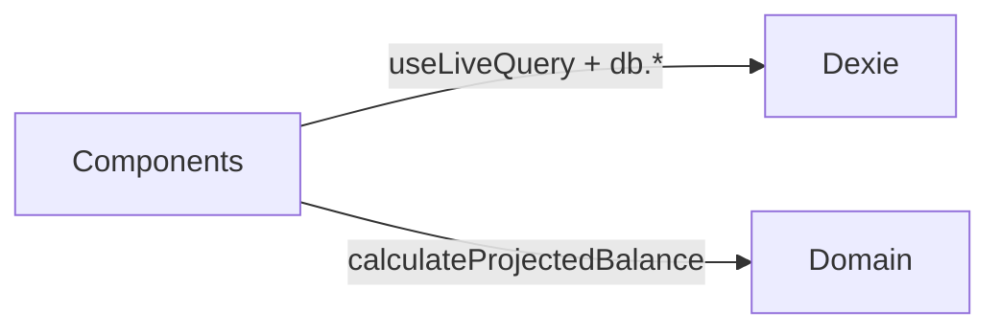
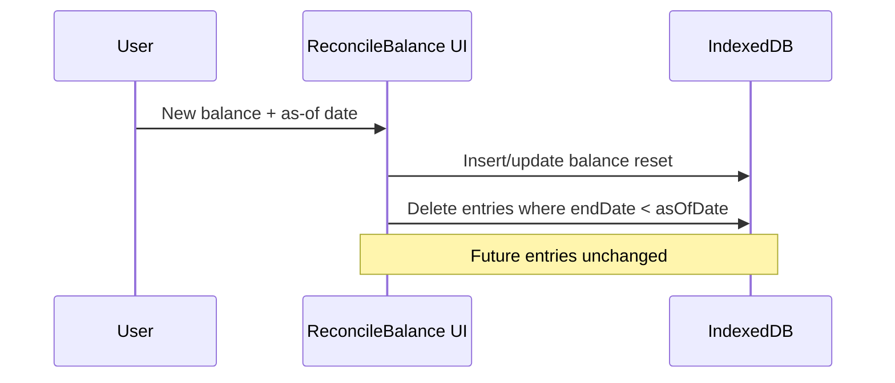

# PTO Planner — Architecture

PTO Planner is a personal, offline-first Progressive Web App for tracking paid time off. It projects your balance forward using semi-monthly accruals, scheduled PTO, and a configurable hours cap—without a backend or user accounts.

This document describes **how the app is built today**, **architectural decisions we are keeping**, and **where we intend to go** before the code catches up.

---

## Goals and constraints

| Decision | Choice |
|----------|--------|
| **Audience** | Personal use only; optimize for one user's ADP-style PTO rules |
| **Hosting / data** | Client-only; IndexedDB via Dexie |
| **Sync** | JSON import/export only—no cloud sync |
| **Navigation** | In-app tabs (no URL routing) |
| **Accrual schedule** | Fixed semi-monthly (1st and 15th); rate is configurable |
| **Work days** | Weekdays only; weekends excluded from PTO deductions |
| **Holidays** | Not modeled; adjust date ranges manually if needed |
| **Balance truth** | Always **derived** from a balance reset + entries + rules—never stored as a separate “current balance” field |

---

## High-level structure



**Dependency rule:** Domain never imports React or Dexie. Presentation never calls `db` directly (target state). Integration orchestrates data hooks, domain functions, and user actions.

---

## Current state (as of main)

What exists in the repo today:

- **Domain:** `src/utils/pto-calc.ts` — accrual generation, projection, cap forecast; accepts `PTOCalcSettings`.
- **Infrastructure:** `src/lib/db.ts` — Dexie schema v1 (`entries`, `resets`, `settings`).
- **Data (partial):** `src/hooks/useAppSettings.ts` only; most features still call `useLiveQuery` and `db` inside components.
- **Presentation:** `src/App.tsx` tab shell; feature components under `src/components/`.
- **Tests:** Vitest unit tests for domain logic (`src/__tests__/pto-calc.test.ts`).



This works at current size but scatters persistence and duplicates queries across Dashboard, Timeline, and ProjectionCalculator.

---

## Target state

### 1. Three-layer components

Each feature follows three layers. **Data hooks** own storage; **integration hooks** compose data + domain + actions; **components** only render.

```
src/
  data/                          # Data layer (fetch / persist)
    ptoEvents/
      useSortedPtoEvents.ts
    balance/
      useBalanceReset.ts
    settings/
      useAppSettings.ts          # (move from src/hooks/)
  components/
    PtoList/
      PtoList.tsx                # Presentation
      usePtoList.ts              # Integration
```

**Data layer** — thin wrappers around Dexie / `useLiveQuery`. No UI, no `confirm`, no domain math.

```ts
// data/ptoEvents/useSortedPtoEvents.ts
export function useSortedPtoEvents() {
  return useLiveQuery(() => db.entries.orderBy('startDate').toArray());
}
```

**Integration layer** — composes data hooks, calls domain functions, exposes handlers and view-model props.

```ts
// components/PtoList/usePtoList.ts
export function usePtoList() {
  const ptoEvents = useSortedPtoEvents();

  return {
    ptoEvents,
    async handleDelete(id: number) {
      if (confirm('Are you sure you want to delete this PTO entry?')) {
        await db.entries.delete(id);
      }
    },
  };
}
```

**Component layer** — markup and styling only.

```tsx
// components/PtoList/PtoList.tsx
export function PtoList() {
  const { ptoEvents, handleDelete } = usePtoList();
  // rendering only
}
```

| Layer | May import | Must not |
|-------|------------|----------|
| Component | Integration hook, UI primitives | `db`, raw `useLiveQuery` |
| Integration | Data hooks, domain, `db` for writes | Heavy JSX |
| Data | `db`, types | React components, domain projection |

> **Note:** Writes can live in integration hooks (as in the example above) or in dedicated data mutations (e.g. `deletePtoEntry(id)` in `data/ptoEvents/`). Prefer **one place per table** for mutations as the app grows.

### 2. Shared integration hooks for projection

Several screens need reset + entries + settings + projection. Target:

```ts
// data/projection/useProjectedBalance.ts (integration or data+domain)
function useProjectedBalance(targetDate: string) {
  const reset = useBalanceReset();
  const entries = usePtoEntries();
  const settings = useAppSettings();
  // return { finalBalance, timeline, totalLost, isLoading } from calculateProjectedBalance(...)
}
```

Dashboard, Timeline, and ProjectionCalculator should consume this instead of duplicating queries and `calculateProjectedBalance` calls.

### 3. Domain module (incremental rename)

Keep logic pure under `src/domain/` (or retain `src/utils/pto-calc.ts` until a move is worthwhile):

| Concern | Responsibility |
|---------|----------------|
| `settings` | `DEFAULT_SETTINGS`, `resolveSettings`, validation |
| `accrual` | Semi-monthly 1st/15th event generation (fixed schedule) |
| `projection` | Balance timeline, cap loss, `forecastCapDate` |

**Invariant:** Accrual **schedule** is fixed in code; **rate** and **max balance** come from settings.

### 4. Balance reconciliation (planned feature)

**Problem:** ADP-reported balance can drift slightly from projections. You need to realign without re-entering future PTO.

**Desired behavior:**

1. User sets a new balance and an **as-of date**.
2. App saves a new `resets` row (or replaces the active reset—TBD in implementation).
3. All PTO **entries with `endDate` before the as-of date** are deleted.
4. Entries on or after the as-of date are **kept**.



**Documentation status:** Specified here; **not yet implemented**. UI likely lives under Settings or Balance setup as “Reconcile balance.”

**Open implementation detail:** Whether to keep reset history or always maintain a single active reset (today: `clear()` + `add()` on initial setup only).

### 5. Onboarding

**Current:** `App` renders `BalanceSetup` when no reset exists.

**Target:** `components/onboarding/` with `BalanceSetup.tsx` + `useBalanceSetup.ts`; `App` only checks `useBalanceReset()` and switches between onboarding and main tabs.

---

## Data model

See [DATA.md](./DATA.md) for schema and backup format.

| Table | Purpose |
|-------|---------|
| `resets` | Anchor: “balance was X hours on date Y” |
| `entries` | PTO date ranges and hours per weekday |
| `settings` | `accrualRate`, `maxBalance` (singleton row in practice) |

**Derived:** Current balance, timeline, cap forecast—computed in domain code, not persisted.

---

## Domain rules (summary)

Full detail: [DOMAIN.md](./DOMAIN.md).

- Accruals on the **1st and 15th** of each month from reset date through target date.
- Default accrual **8.3333333333 h** per period; default cap **240 h** (overridable in settings).
- On the same calendar day, **accrual applies before PTO deduction**.
- PTO spans deduct **weekdays only** at `hoursPerDay`.
- Cap overflow on accrual is recorded as `lostAmount` on timeline events.

---

## Application shell

`App.tsx` owns:

- Tab state (`dashboard` | `pto` | `timeline` | `settings`)
- Sticky header + mobile bottom nav
- Onboarding gate when no reset

No React Router—tabs are sufficient for this project.

---

## Non-goals

- Multi-user accounts, authentication, or server API
- Cloud sync or real-time backup
- Configurable accrual schedules (monthly, biweekly, etc.) unless requirements change
- First-class company holiday calendar
- URL-based routing and deep links
- Storing computed balance in the database

---

## Testing strategy

| Layer | Approach |
|-------|----------|
| Domain | Vitest unit tests (`npm test`)—primary safety net |
| Data / integration | Add when logic appears (e.g. reconciliation deletes correct rows) |
| UI | Manual / optional browser tests later |

---

## Migration roadmap

Prioritized path from current code to target architecture. **Docs may describe steps before code implements them.**

| Priority | Item | Status |
|----------|------|--------|
| P0 | Document architecture (this file) | Done |
| P0 | Settings wired to domain + UI | Done |
| P1 | Introduce `data/` hooks: `useBalanceReset`, `useSortedPtoEvents`, move `useAppSettings` | Done |
| P1 | Refactor features to component + `useFeature` pattern (`PtoList` first) | Done |
| P1 | `useProjectedBalance(targetDate)` shared hook | Done |
| P2 | Balance reconciliation flow | Planned |
| P2 | Colocate features in folders (`Dashboard/`, `Settings/`, …) | Planned |
| P2 | Extract more shared layout components as patterns repeat | Ongoing |
| P3 | Rename `utils/pto-calc` → `domain/` | Optional |
| P3 | Extract write helpers (`deletePtoEntry`, `saveSettings`) in data layer | Optional |
| P3 | shadcn wrappers in `components/app/` (tabs, card layouts) | Optional |

---

## Styling

Application components use **Tailwind utilities in TSX** and compose **shadcn/ui** primitives from `src/components/ui/`. Shared UI patterns live in small components (`StatCard`, `SectionCard`). Theme: `next-themes` + CSS variables in `src/index.css`.

See [STYLING.md](./STYLING.md).

---

## Related documents

- [DOMAIN.md](./DOMAIN.md) — projection algorithm and business rules
- [DATA.md](./DATA.md) — Dexie schema, import/export, migrations
- [STYLING.md](./STYLING.md) — semantic classes, shadcn wrappers, migration
