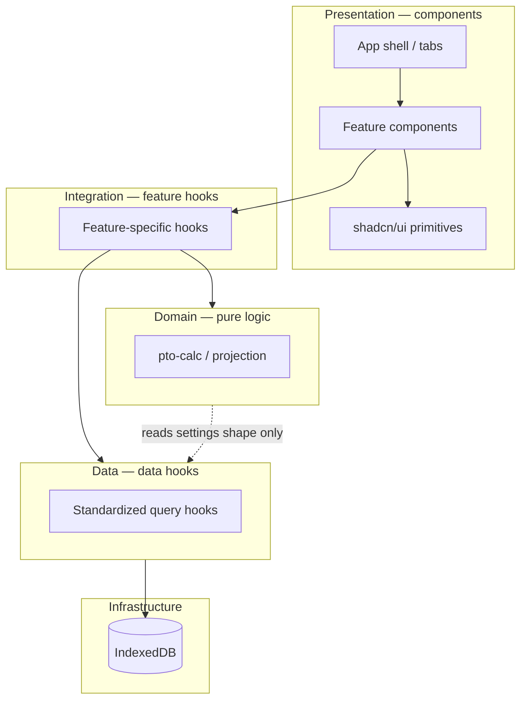

# PTO Planner — Architecture

PTO Planner is a personal, offline-first Progressive Web App for tracking paid time off. It projects your balance forward using semi-monthly accruals, scheduled PTO, and a configurable hours cap—without a backend or user accounts.

This document describes the application's 3-layer architecture, state management patterns, and design decisions.

---

## Goals and constraints

| Decision | Choice |
|----------|--------|
| **Audience** | Personal use only; optimize for one user's ADP-style PTO rules |
| **Hosting / data** | Client-only; IndexedDB via Dexie |
| **Sync** | JSON import/export only—no cloud sync |
| **Navigation** | In-app tabs (no URL routing) |
| **Accrual schedule** | Fixed semi-monthly (1st and 15th); rate is configurable |
| **Work days** | Weekdays only; weekends excluded from PTO deductions |
| **Holidays** | Not modeled; adjust date ranges manually if needed |
| **Balance truth** | Always **derived** from a balance reset + entries + rules—never stored as a separate “current balance” field |

---

## High-level structure

The app follows a strict **3-layer architecture** to separate persistence, orchestration, and presentation.

### Dependency Rules
- **Domain** never imports React or Dexie. It is pure TypeScript logic.
- **Data Layer** owns database queries and ensures real-time updates via `useLiveQuery`.
- **Integration Layer** orchestrates data hooks, domain math, and user actions (writes).
- **Presentation Layer** (Components) only renders UI and consumes feature hooks. It never calls the database directly.

---

## The 3 Layers in Detail

### 1. Data Layer (`src/data/`)
Centralized hooks for IndexedDB queries. These use a standardized `queryReducer` to track `status` (`loading` | `success` | `error`), `data`, and `error`.

- **Pattern:** `useLiveQuery` + `useReducer(queryReducer)`.
- **Location:** `src/data/ptoEvents/`, `src/data/balance/`, etc.
- **Mutations:** Shared write helpers can live here or in the Integration layer.

### 2. Integration Layer (`src/components/<Feature>/use<Feature>.ts`)
Custom hooks colocated with their feature components. They compose data hooks and domain logic into a "view model" for the UI.

- **UI State:** Uses `useReducer(uiReducer)` to manage complex flows like form submissions, editing states, and modal toggles.
- **Orchestration:** Calculates projections, formats data for display, and handles callbacks for user actions.

### 3. Component Layer (`src/components/<Feature>/<Feature>.tsx`)
Pure presentation components.

- **Standard:** Every major feature is in its own folder with an `index.ts` entry point, a `.tsx` component, and a `use<Feature>.ts` hook.

---

## State Management

We use two distinct types of reducers:
1. **Query Reducers:** Standardized state machine for data-fetching (`FETCH_START`, `FETCH_SUCCESS`, `FETCH_ERROR`).
2. **UI Reducers:** Feature-specific state for user interactions (e.g., `START_EDIT`, `SET_FIELD`, `SUBMIT_START`).

This separation keeps database status isolated from ephemeral UI state (like which row is currently being edited).

---

## Domain Logic

Pure logic lives in `src/utils/pto-calc.ts`.

| Concern | Responsibility |
|---------|----------------|
| `settings` | `DEFAULT_SETTINGS`, `resolveSettings`, validation |
| `accrual` | Semi-monthly 1st/15th event generation |
| `projection` | Balance timeline, cap loss, `forecastCapDate` |

**Invariant:** Accrual **schedule** is fixed; **rate** and **max balance** are configurable.

---

## Balance Reconciliation (Planned)

**Problem:** ADP-reported balance can drift from projections.

**Desired behavior:**
1. User sets a new balance and an **as-of date**.
2. App replaces the active `resets` row.
3. All PTO **entries with `endDate` before the as-of date** are pruned.
4. Entries on or after the as-of date are kept for projection.

---

## Development Roadmap

| Priority | Item | Status |
|----------|------|--------|
| P0 | 3-Layer Architecture Implementation | Done |
| P0 | Standardized Query Reducer | Done |
| P1 | Feature Colocation (Folders + Hooks) | Done |
| P1 | Shared `useProjectedBalance` hook | Done |
| P2 | Balance reconciliation flow | Planned |
| P2 | Enhanced Test Coverage (Integration/UI) | Planned |
| P3 | Rename `utils/pto-calc` → `domain/` | Optional |

---

## Related Documents

- [DOMAIN.md](./DOMAIN.md) — projection algorithm and business rules
- [DATA.md](./DATA.md) — Dexie schema and data layer patterns
- [STYLING.md](./STYLING.md) — tailwind and shadcn conventions
